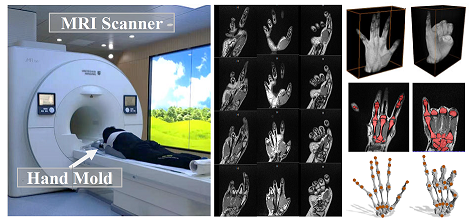
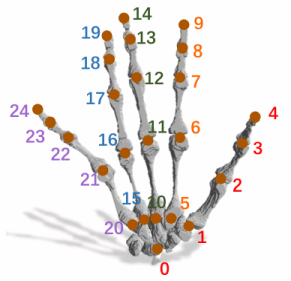

HAND MRI Dataset (PIANO)
========



The is the dataset used in **_PIANO: A Parametric Hand Bone Model from Magnetic Resonance Imaging_** and **_NIMBLE: A Non-rigid Hand Model with Bones and Muscles_**.

To learn more, please visit project website at [PIANO](https://liyuwei.cc/proj/piano) and [NIMBLE](https://liyuwei.cc/proj/nimble).


For comments and questions, please email us at: Yuwei Li (liyw@shanghaitech.edu.cn)

---

## MRI Dataset Part 1 (50 vols)
1. MRI raw volume [[Google Drive]](https://drive.google.com/file/d/1KPEIu4FetGbLwzfKoHk4sSHEim29ox-8/view?usp=sharing)
2. Bone mask volume [[Google Drive]](https://drive.google.com/file/d/1SQppuej7C7JugeiPh4JK00yuIkOW60Wz/view?usp=sharing)
3. 3D joint annotation (in physical space) [[Google Drive]](https://drive.google.com/file/d/1imikru7d64WdoR5Mt5vuU7mMqFQ0tVr_/view?usp=sharing)

## Annotation Extension
1. **Muscle mask volume (From [NIMBLE](https://liyuwei.cc/proj/nimble))**  [[Google Drive]](https://drive.google.com/file/d/1TuU8Co85_ctvj6yjotms-PTKredzl0QF/view?usp=sharing)


## Useful code - [mask2mesh.py](https://github.com/reyuwei/PIANO_mri_data/blob/master/mask2mesh.py)
- Generate mesh from volume mask
```py
mri_mask = "00001_bonemuscle.nii"
mri_mask_vol = sitk.ReadImage(mri_mask)
bone_mesh = generate_seg_mesh(mri_mask_vol, 1)
muscle_mesh = generate_seg_mesh(mri_mask_vol, 2)

bone_mesh.export("bone.obj")
muscle_mesh.export("muscle.obj")
```
- Naive fine-grained bone mask
```py
joints_file = "00001_joints.txt"
joints3d = np.loadtxt(joints_file)
semantic_bonemesh = finegrained_bone(joints3d, bone_mesh)
semantic_bonemesh.export("sbone.obj")
```
- Automatic surface segmentation
```py
mri_raw = "00001.nii"
surf_mask_vol = naive_seg(sitk.ReadImage(mri_raw))
surf_mesh = generate_seg_mesh(surf_mask_vol)
surf_mesh.export("surf.obj")
```
   
  

---
## Joint ID


---

If you find this data useful for your research, consider citing:

```
@inproceedings{li2021piano,
  title     = {PIANO: A Parametric Hand Bone Model from Magnetic Resonance Imaging},
  author    = {Li, Yuwei and Wu, Minye and Zhang, Yuyao and Xu, Lan and Yu, Jingyi},
  booktitle = {Proceedings of the Thirtieth International Joint Conference on
               Artificial Intelligence, {IJCAI-21}},
  editor    = {Zhi-Hua Zhou},
  pages     = {816--822},
  year      = {2021},
  month     = {8},
  note      = {Main Track},
  doi       = {10.24963/ijcai.2021/113},
  url       = {https://doi.org/10.24963/ijcai.2021/113}
}

@misc{li2022nimble,
  title         = {NIMBLE: A Non-rigid Hand Model with Bones and Muscles},
  author        = {Li, Yuwei and Zhang, Longwen and Qiu, Zesong and Jiang, 
                   Yingwenqi and Zhang, Yuyao and Li, Nianyi and Ma, Yuexin 
                   and Xu, Lan and Yu, Jingyi},
  year          = {2022},
  eprint        = {2202.04533},
  archiveprefix = {arXiv},
  primaryclass  = {cs.CV}
}

```
