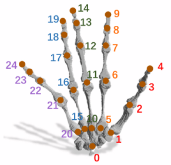

PIANO Dataset
========

The is the dataset proposed in PIANO: A Parametric Hand Bone Model from Magnetic Resonance Imaging 

To learn about PIANO, please visit our website: https://liyuwei.cc/proj/piano

You can find the paper at: https://www.ijcai.org/proceedings/2021/0113.pdf


For comments or questions, please email us at: Yuwei Li (liyw@shanghaitech.edu.cn)

---

## MRI Dataset Part 1 (50 vols)
1. MRI raw volume [[Google Drive]](https://drive.google.com/file/d/1KPEIu4FetGbLwzfKoHk4sSHEim29ox-8/view?usp=sharing)
2. Bone mask volume [[Google Drive]](https://drive.google.com/file/d/1SQppuej7C7JugeiPh4JK00yuIkOW60Wz/view?usp=sharing)
3. 3D joint annotation (in physical space) [[Google Drive]](https://drive.google.com/file/d/1imikru7d64WdoR5Mt5vuU7mMqFQ0tVr_/view?usp=sharing)

## Annotation Extension
1. **Muscle mask volume [See [NIMBLE](https://liyuwei.cc/proj/nimble)]**

## Processing code
1. Generate fine-grained semantic mask. [Coming Soon..]
2. Generate mesh from volume mask.  [Coming Soon..]

---
## Joint ID


---

If you find this data useful for your research, consider citing:

```
@inproceedings{li2021piano,
  title     = {PIANO: A Parametric Hand Bone Model from Magnetic Resonance Imaging},
  author    = {Li, Yuwei and Wu, Minye and Zhang, Yuyao and Xu, Lan and Yu, Jingyi},
  booktitle = {Proceedings of the Thirtieth International Joint Conference on
               Artificial Intelligence, {IJCAI-21}},
  publisher = {International Joint Conferences on Artificial Intelligence Organization},
  editor    = {Zhi-Hua Zhou},
  pages     = {816--822},
  year      = {2021},
  month     = {8},
  note      = {Main Track},
  doi       = {10.24963/ijcai.2021/113},
  url       = {https://doi.org/10.24963/ijcai.2021/113}
}

```
